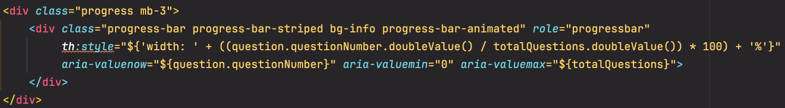
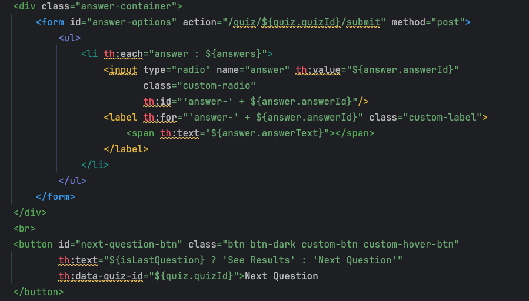

# Trivio Quiz App

## Project Overview
The Trivio Quiz App is a web-based application designed to provide users with an interactive quiz-taking experience. Users can select a quiz from the home page, answer questions sequentially, and view their final scores at the conclusion of each quiz. The application is built with Java, Spring Boot, Thymeleaf, JavaScript, and the Fetch API to enable dynamic question loading.

This project was developed using pair programming, where team members alternated between driving and navigating roles. Task management was facilitated using a Trello board, while LucidChart was employed to create design diagrams and plan the application's architecture.

## Key Technologies and Tools
- **Programming Languages:** Java, JavaScript
- **Frameworks:** Spring Boot (Backend), Thymeleaf (Frontend Templating)
- **APIs:** Fetch API (Dynamic Data Loading)
- **Database:** MySQL
- **Version Control:** Git (GitHub)
- **Project Management:** Trello (Task Management)
- **Design Tools:** LucidChart (Flowcharts and Diagrams)
- **Development Environment:** IntelliJ IDEA CE
- **Testing:** Browser DevTools

## Key Features
- **Quiz Selection:** Users can choose from various quizzes available on the home page.
- **Dynamic Question Loading:** JavaScript and the Fetch API are utilized to load questions dynamically, enhancing the user experience.
- **Score Display:** The user's total score is displayed at the end of each quiz, providing immediate feedback.

## Development Process: Planning and Design
The development process followed a structured approach, guided by a Kanban board in Trello. The project was divided into manageable tasks to monitor progress and maintain focus throughout the development cycle.

Lucidchart was used to create flowcharts and diagrams, helping visualize the application's architecture, data flow, and the layout of each page to ensure a coherent design strategy.

## Key Development Stages
The project was executed following a ten-step development plan:

- **1. Setup:** Cloned the repository, ran the provided database script, and ensured a stable connection between the database and the application. 
- **2. Project Planning:** Familiarized ourselves with the data in our database. Conducted brainstorming sessions to define goals and create visual diagrams for page layouts and functionality. Tasks were broken down and prioritized on Trello, allowing effective time management and focus on critical features.
- **3. Data Access Objects (DAO):** Developed the DAO methods to handle database interactions, including retrieving quizzes, questions, and possible answers.
- **4. Controllers:** Implemented controllers to manage HTTP requests and handle data flow between the front end and the back end.
- **5. HTML Development:** Created the basic HTML structure for the home and quiz pages.
- **6. JavaScript Functionality:** Developed JavaScript to manage quiz logic, including loading the selected quiz, initiating the quiz with a start button, dynamically loading questions using the Fetch API, tracking the user's score, and implementing a next button to proceed to subsequent questions.
- **7. Styling:** Designed the user interface for a more intuitive and engaging user experience.
- **8. Content Expansion:** Populated the database with additional quizzes to provide a richer user experience.
- **9. Testing:** Conducted user testing internally and with family members to ensure a smooth and enjoyable experience.
- **10. Code Optimization:** Refactored the codebase to enhance readability, maintainability, and performance.

## Challenges Encountered
Several challenges were addressed during development, including:

- **Backend Challenge:** Initially, the "Next" button was visible upon starting the quiz, and it failed to navigate to the next page when clicked.
  - **Problem:** The "next" button was not hidden when the user started their quiz, and the button did not navigate the user to the next page.
  - **Approach:** We investigated the URL path and observed that the quiz ID was being correctly passed into the URL as a string. Despite this, the button did not perform the expected navigation.
  - **Solution:** Upon further inspection, we identified that the issue lay within the HTML file. Specifically, the quizId was not being dynamically bound to the "Next" button due to the absence of proper Thymeleaf attribute bindings. By incorporating Thymeleaf syntax (e.g., th:id and th:data-quiz-id) to dynamically inject the quiz ID into the button element, we resolved the path issue. This adjustment ensured that the button correctly redirected to the intended path, enabling the user to proceed to the next question. Additionally, the modification addressed the visibility issue; the "Next" button now remains hidden until the user selects an answer, thus providing a more intuitive and functional user experience.

- **Backend Challenge:** Accurately calculating and displaying the final score on the results page.
  - **Problem:** The final score consistently displayed as zero, despite having implemented logic to compare user answers with correct answers.
  - **Approach:** We examined the console outputs to diagnose the issue, focusing on the correct answers, user answers, and their respective IDs. It was observed that the array lists for answers were empty, and the correct answer IDs were appearing as "undefined."
  - **Solution:** The issue stemmed from the fact that while we had correctly retrieved and stored both the correct answers and user answers, the scoring function responsible for performing the calculations had not been invoked. Additionally, when the function was eventually called, the required parameter (the quiz ID) was missing. To resolve this, we ensured that the scoring function was properly invoked with the necessary parameter, enabling accurate calculations. This adjustment corrected the issue, allowing the final score to be computed and displayed as intended.

- **Frontend Challenge:** Enabling the radio button to select an answer when the user clicked on the answer's text.
  - **Problem:** The radio button behavior was incorrect: clicking on any answer text would select the first answer’s radio button. 
  - **Approach:** Debugged the JavaScript to ensure that the value attribute of the radio buttons was being correctly set and retrieved.
  - **Solution:** Updated the JavaScript to correctly fetch the selectedAnswerId from the radio button group, ensuring that the value is captured accurately and passed to the backend.

- **Frontend Challenge:** Implementing a progress bar that accurately reflects the user's progress through the quiz.
  - **Problem:** The progress bar would remain empty until the very last question and then it would be 100%. 
  - **Approach:**  Investigated the JavaScript logic responsible for updating the progress bar, focusing on how it was being calculated and displayed.
  - **Solution:** Refactored the JavaScript code to properly calculate and update the progress bar percentage based on the total number of questions and the current question index.

## Favorite Block of Code
### Tabatha

**Favorite Code Block: Progress Bar**

I chose this block of code because it brings a dynamic and visually appealing "wow factor" to the user experience by displaying an animated progress bar. Implementing this feature involved ensuring the progress bar accurately reflects the user's current progress through a series of questions, which required precise calculations. I learned how to use Thymeleaf expressions to dynamically set styles in a way that updates the progress bar's width in real-time based on the user's progress. This was a challenging yet rewarding experience, as it involved both front-end and back-end integration to achieve a seamless, responsive design element.

### Valerie

**Favorite Code Block: Answer Container and "Next Question" Button**

My favorite code block in the project is the implementation of the answer container and the "Next Question" button. This section presented our primary challenge, but overcoming it was incredibly satisfying and integral to the core functionality of the application.

This code block not only reinforced my understanding of how to integrate various components but also provided a comprehensive learning experience. It involved:
1. **Defining Data Structures**: Crafting the appropriate data transfer objects (DTOs) to ensure that data could be effectively communicated between different parts of the application.
2. **Data Retrieval**: Employing Data Access Objects (DAOs) to query specific data from the SQL database, ensuring accurate and efficient data handling.
3. **Backend to Client Integration**: Using controllers to bridge the backend logic with the client-side view, ensuring that dynamic data was correctly served to the front end.
4. **View and Event Handling**: Connecting the HTML views with JavaScript events, which required careful management of Thymeleaf templating to dynamically render content and interact with user actions.

This experience significantly deepened my knowledge of dynamic programming and the effective use of Thymeleaf for server-side rendering. It highlighted the importance of ensuring seamless interaction between backend processes and frontend display, and it showcased the power of Thymeleaf in building dynamic, data-driven user interfaces. Working on Trivio makes me excited to learn more about what we're capable of achieving with our new skills, and I look forward to learning even more in sprint 3!

## Acknowledgments
We extend our gratitude to our instructor, Gregor, for his invaluable guidance and support throughout this project. Additionally, we appreciate the constructive feedback provided by our peers during our project presentation.